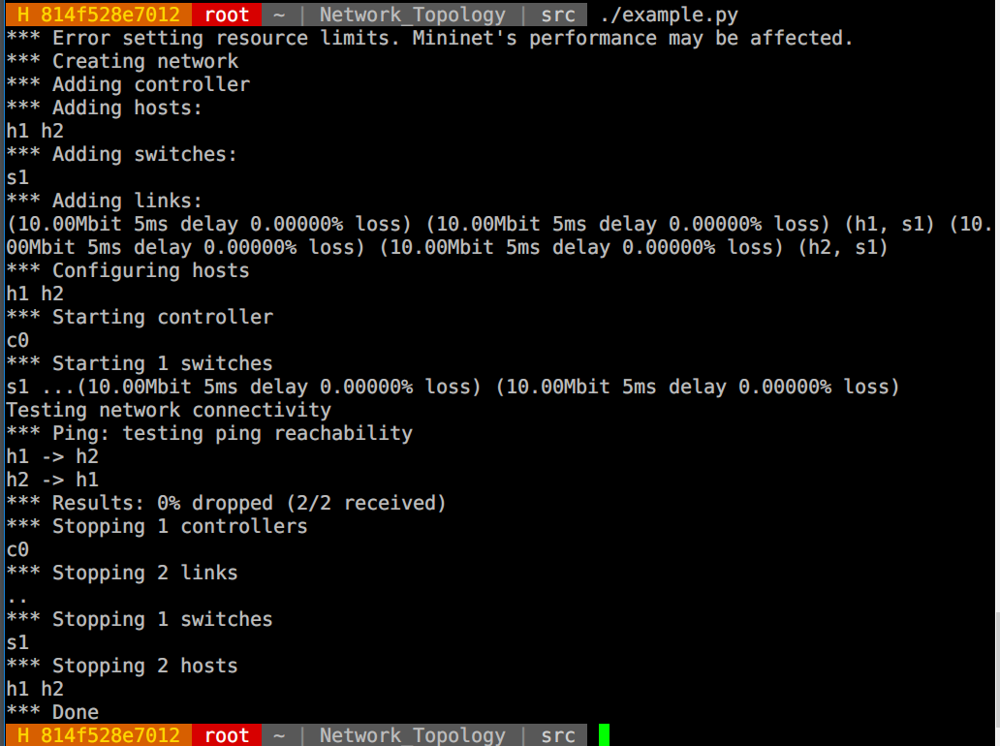

# Network Topology with Mininet

This repository is lab for NCTU course "Introduction to Computer Networks 2018".

---
## Abstract

In this lab, we are going to write a Python program which can generate a network topology using Mininet and use iPerf to measure the bandwidth of the topology.

---
## Objectives

1. Learn how to create a network topology with Mininet
2. Learn how to measure the bandwidth in your network topology with iPerf

---
## Execution
> create network topology accroding to ./src/topo/topo0.png
> Execute in the Ubuntu container(mininet & python installed)
> If it shows errors like "mininet...File exists...", clean Mininet
> `$ [sudo] mn -c`

#### How to execute this program?

**1. Change directory to the location of the program**\
`$ cd /root/Network_Topology/src`

**2. Add execute permission to the program**\
`$ chmod +x topology.py`

**3. Run the program, it would enter Mininet cli-mode & Dump the information of hosts and switches**\
`$ ./topology.py`
`----info about hosts & switches-----`
`mininet>`

**4. Run iPerf in server h2 & client h6, output the result of server to file ./out/result**\
`mininet> h2 iperf -s -u -i 1 > ./out/result &`
`mininet> h6 iperf -c 10.0.0.2 -u –i 1`

**5. The progrm would output the result of client, just like the following screenshot**\
The rate of packet loss is an approximate value from 21% ~ 26%\
(check the red block of the screenshot)
### Screenshot of using iPerf command in Mininet

**6. Enter `exit` or ctrl+c to exit cli**

---
## Description

### Mininet API in Python
* **How to use Mininet API in Python?**\
Mininet provides many classes in the certain module.\
Use following ways to import modules in python script.\
`from mininet[.xxx] import ooo`\
or\
`import mininet[.xxx]`
- **Meaning of Miniet API**
    - mininet.net.Mininet
        - Network emulation with hosts spawned in network namespaces.
        - We need the 'Mininet' class to creates a realistic virtual network.
    - mininet.topo.Topo
        - Data center network representation for structured multi-trees.
        - Create the customized network structure by inheriting the class 'Topo'.
    - mininet.node.OVSController
        - Use Open vSwitch as the OpenFlow controller.
    - mininet.link.TCLink
        - Use Link with symmetric TC interfaces. (a basic link is just a Virtual ETHernet)
    - mininet.util.dumpNodeConnections
        - A useful Function to dump the information about nodes.
        - We use this to check hosts & switches created by Mininet.
    - mininet.cli.CLI
        - Simple command-line interface to talk to nodes.
        - We use CLI to run iPerf on certain hosts.

### iPerf Commands

> iPerf version 2.0.5 

**Meaning of iPerf command**
- `h2 iperf -s -u -i 1 > ./out/result &`
    - `h2`\
    Use the host 'h2'
    - `-s`\
    Run iPerf in **server** mode
    - `-u`\
    Use UDP rather than TCP\
    Bandwith with UDP is default 1 Mbps, and you can also set it in client's command with `-b <bw>`
    - `-i <interval>`\
    Set the interval time in seconds between periodic bandwidth, jitter, and loss reports.\
    If non-zero, a report is made every interval seconds of the bandwidth since the last report.\
    If zero, no periodic reports are printed.\
    Default is zero.
    iPerf would sends for 10 seconds by default, so we get 10 reports. You can set the it in client's command with `-t <time>`
    - `> ./out/result`\
    Redirect the stdout to file ./out/result
    In this case, We get the output from the server.
    - `&`\
    Execute the command in the background without waiting for the command to finish.\
    We let server run in the background, so we can run the client at the same time.
- `h6 iperf -c 10.0.0.2 -u -i 1`
    - `h6`\
    Use the host 'h6'
    - `-c <host>`\
    Run iPerf in **client** mode, connecting to an iPerf server running on \<host\>.\
    h2's ip is 10.0.0.2.
    - `-u`, `-i <interval>`\
    As mentioned above

### Tasks

1. **Environment Setup**
    1. Join the GitHub Classroom in order to get an initial repository prepared by TAs.
    2. Login the personal container.\
    `IP address:140.113.195.69`
    `Port: last 5 digits of student ID`
    Login as root, default password:cn2018\
    Then change the password with command `passwd`)\
	Now password is **1234**
    3. Clone GitHub repository
    `$ git clone https://github.com/nctucn/lab2-phlee1117.git Network_Topology`
    Then we get the git repository in folder Network_Topology under the /root/
    4. Run Mininet for testing\
    Use the command `mn` to get into mininet's interactive shell.
    `$ mn`
    `mininet>`
2. **Example of Mininet**
    Execute the example.py
    1. First change directory to the code location.
    `$ cd /root/Network_Topology/src/`
    2. Add execute permission to the script using command `chmod`.\
    `$ chmod +x example.py`
    3. Run the example.\
    `$ ./example.py`

    The result of running example.py
    

    If you get errors like this\
    
    Try this command\
    `$ mn -c`
    This would clean up the mininet. (kill existed nodes or process, etc)
    
3. **Topology Generator**
    1. View the topology you should generate\
    Divide student ID by 3 to get the remainder\
    Therefore mine is **topo0.png**
    
    2. Generate the topology via Mininet accroding to topo0.png\
    I refer to the example.py to complete following tasks
    - Add python path to shebang #!
    `#!/usr/bin/python`
    Tell the system program loader to use python as interpreter program.
    - Import required modules
    meanings of the modules are already explained above
    - Create hosts and switches
    In example.py, it creates a class inherited from mininet.topo.Topo, and define its own 'build' function inside the class.\
    We can create our own class 'Topo0' and use that 'build' function to create nodes.\
    `class Topo0(Topo):`
    In the build function `def build(self):`
    Use `self.addHost` & `self.addSwitch` to create hosts & switches.\
    for example:`self.addHost(h1)`
    - Construct links & Configure link bandwidth, delay, and loss rate
    In the 'build' function of self-defined class, use `self.addLink` to establish links between nodes.\
    Here we can set the option like bandwidth, delay, rate of packet loss, etc. Use the settings from topo0.png.
    for example:`self.addLink('h1', 's1', bw = 10, delay='50us', loss = 12)`
    3. Setting the Mininet
    Use the created class as the topology structure with Open vSwitch & TCLink.
    `net = Mininet(topo = Topo0, controller = OVSController, link = TCLink)`
    After start it up, dump the infromation about hosts & switches
    `net.start()`
    `dumpNodeConnections(net.hosts)`
    `dumpNodeConnections(net.switches)`
    Then enter the command-line interface of mininet
    `CLI(net)`

4. **Measurement**
    **---most have been mentioned in the execution part---**
    - After finishing the code, we need to EXECUTE the program.
    - We use the following 2 iPerf commands to measure if the topology we built is correct.
    `$ mininet> h2 iperf -s -u -i 1 > ./out/result &`
    `$ mininet> h6 iperf -c 10.0.0.2 -u –i 1`
    - The ouput file 'result' would be in '/root/Newtork_Topology/src/out/result/'
---
## References

* **Mininet**
    * [Mininet Python API Reference Manual](http://mininet.org/api/annotated.html)
    * [GitHub/OSE-Lab - 熟悉如何使用 Mininet](https://github.com/OSE-Lab/Learning-SDN/blob/master/Mininet/README.md)
* **Python**
    * [OpenHome.cc - Python Class](https://openhome.cc/Gossip/Python/Class.html)
* **Iperf**
    * [可丁丹尼 - 利用 iperf 測試網路效能](https://cms.35g.tw/coding/%E5%88%A9%E7%94%A8-iperf-%E6%B8%AC%E8%A9%A6%E7%B6%B2%E8%B7%AF%E6%95%88%E8%83%BD/)
    * [iPerf3 User Documentation](https://iperf.fr/iperf-doc.php#3doc)
* **Markdown**
    * [Cheat Sheet of Markdown Syntax](https://www.markdownguide.org/cheat-sheet)
    * [Markdown 語法說明](https://markdown.tw/)

---
## Contributors

* [Hank Lee](https://github.com/phlee1117)
* [David Lu](https://github.com/yungshenglu)

---
## License

GNU GENERAL PUBLIC LICENSE Version 3
